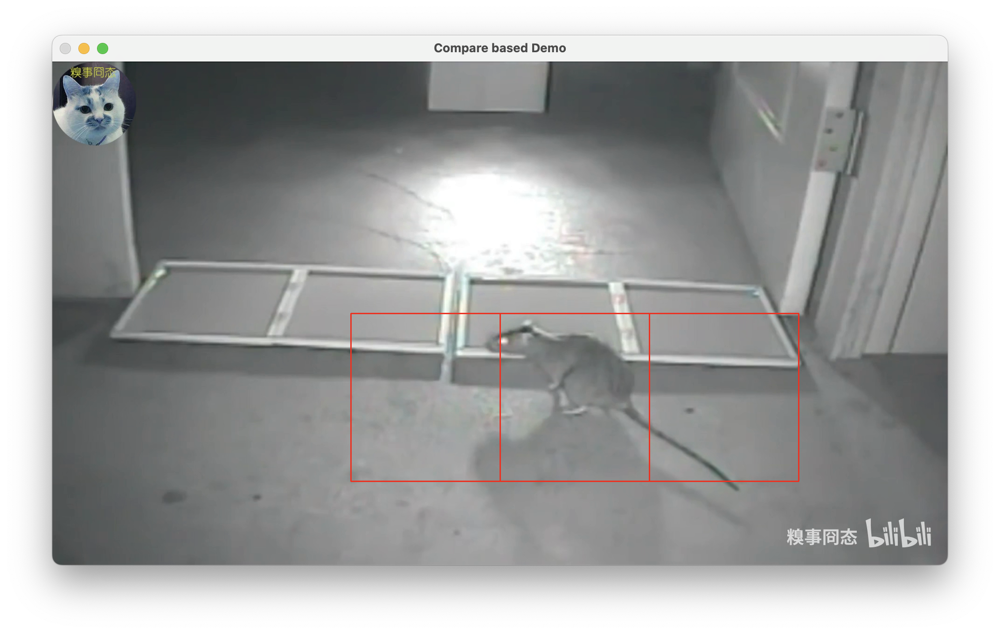
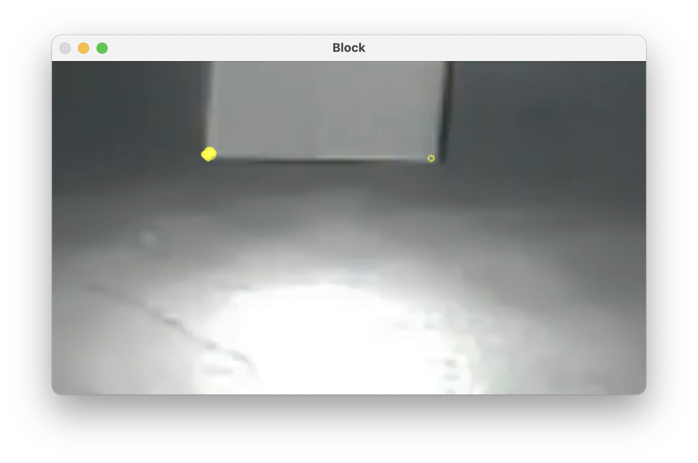
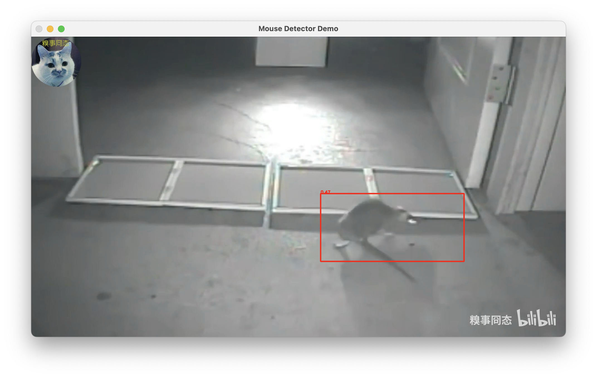

# Room Watcher
**关键词：**厨房、家居、老鼠、蟑螂、异常物体检测

# 1. 项目简要说明

此项目的设计目标是完成对厨房中异常的监测，识别是否存在异常、异常的大致位置等。
（注：异常表示老鼠、蟑螂等。）

## 1.1. 所使用的算法

- 目标检测算法：目前所使用的是 YOLOv5-Small-Target（简称 YOLOv5-ST）、 YOLOv8、YOLOv8-Small-Target（简称 YOLOv8-ST）、SuperYOLO 算法，该算法基于图像块分割计算。以及提供基于像素计算的 Faster R-CNN 算法。
- 图像比较算法：提取一定时间间隔的不同图像，计算图像的相似度，包括
  - 基于特征点：基于 ORB 特征点及描述子进行图像匹配；基于 FAST 特征点和 BRIEF 描述子进行图像匹配。
  - 基于 SSIM 算法：使用 SSIM 算法进行图像比较。
  - 基于图像直方分布：使用直方分布进行图像比较。
  - 基于模板匹配：使用模板匹配进行图像比较。
  - 基于图像灰度差：使用图像灰度差值进行图像比较。

## 1.2. 硬件驱动及预训练模型

- 提供了已经训练好的 YOLOv5-ST 模型，包括在自采集数据集上训练的 MiceDet-5lst-sc-v1、MiceDet-5lst-sc-v2。
- 提供了已经训练好的 YOLOv8 模型，包括在自采集数据集上训练的 MiceDet-8l-sc、MiceDet-8m-sc、MiceDet-8s-sc、MiceDet-8n-sc，在开源数据集上训练的 MiceDet-8n-dm、MiceDet-8s-dm、MiceDet-8n-rd、MiceDet-8s-rd。
- 提供了已经训练好的 YOLOv8-ST 模型，包括在自采集数据集上训练的 MiceDet-8lst-sc、MiceDet-8mst-sc。
- 提供了已经训练好的 Faster R-CNN 模型，包括在自采集数据集上训练的 MiceDet-frcnn-sc。
- 可以使用 GPU 调用，也可以使用 CPU 调用。
- 数据来源：
    - 以 `-sc` 结尾的模型为自采集数据训练而成，不对外开放。
    - 以 `-dm` 结尾的模型训练数据来自：https://universe.roboflow.com/forniturerecognitio/dark-mice
    - 以 `-rd` 结尾的模型训练数据来自：https://universe.roboflow.com/saeed-zekkt/rat-detection-gdpbn
    - 由于前期编程围绕老鼠识别开展，故训练数据只使用了老鼠检测；极小型生物如蟑螂等难以找到合适数据集且目标检测算法不一定能很好识别，故对于这些物体的分析主要考虑对比图像相似度来间接识别。


# 2. 代码文件简要说明

## 2.1. 主要驱动代码文件

| 文件名                   | 功能                     |
| ----------------------- | ----------------------- |
| `argparser.py`          | 解析 `config.yaml` 中的参数设定。 |
| `demo.py`               | DEMO 文件，可以使用 3 种方式进行样例测试，包括 `compare-based`（仅使用图像对比）、`direct-detection`（仅使用目标检测）、`mixture`（图像对比和目标检测混用）。 |
| `detect.py`             | 调用目标检测算法实现图像检测，包括 YOLOv5-ST、YOLOv8、YOLOv8-ST、YOLOv10、Faster R-CNN、HOG，最后者为 OpenCV 的行人检测。 |
| `logger.py`             | 日志打印控制。 |
| `main.py`               | 程序入口。 |
| `timegap.py`            | 用于计算连续两帧或多帧图像都出现异常时的时间跨度，**暂未使用**。 |
| `window.py`             | 滑动窗口保存 `n` 帧图像的检测结果，**暂未使用**。 |
| `config.yaml`           | 自定义参数配置文件。 |
| `requirements.txt`      | Python 虚拟环境依赖库。 |

## 2.2. 其他文件或目录

| 文件名或目录名                | 功能                     |
| --------------------------- | ----------------------- |
| `config`                    | 存放配置文件，多个配置文件对应了在运行过程中可能需要生成多个检测器对象。 |
| `detector`                  | 存放目标检测模型调用代码，其中 `base.py` 中为检测器的父类，记录了一些检测设置。 |
| `frame`                     | `frame.py` 用于生成图像帧，每帧包括图像的时间戳、大小、彩色图、灰度图、图像块（图像块大小、位置，计算特征点、描述子），也可以调用类函数展示图像；`utils.py` 用于提供辅助帧处理的函数，如 OCR 文字检测等。 |
| `compare`                   | 文件 `compare.py` 使用算法进行图像对比，包括特征点比对算法、图像相似度算法等；文件 `utils.py` 则存放辅助函数，包括处理图像块中的内容等。 |
| `videostream`               | 存放视频获取及处理代码，包括平台的视频流 API 处理以及图像获取保存。 |
| `tasks`                     | 处理多线程任务，定时调用 API 获取图像，同时通过对比图像进行相似度计算。 |
| `logs`                      | 日志保存目录，使用当日日期为文件名。 |
| `yolov10`                   | 存放 YOLOv10 的源代码。 |
| `models`                    | 存放 YOLOv5-ST 模型载入辅助代码。 |
| `utils`                     | 存放 YOLOv5-ST 模型载入辅助代码。 |
| `datasets`                  | 数据集存放目录，提供有自 RoboFlow 下载的 dark-mice、Rat Detection 数据集（数据标注格式包括 voc 及 yolov8）以及 VOC 2007 数据集，同时包含有 KitchenMice 数据集，及自采集数据。 |
| `faster_rcnn`               | 参考 PyTorch 版 Faster R-CNN 摘写的检测代码，用于辅助使用该算法进行目标检测（暂未测试）。 |
| `support`                   | 存放 YOLOv5-ST 模型载入辅助代码的压缩包 `yolov5_models.zip` 和 `yolov5_utils.zip`，其本质为 `models` 和 `utils` 的修改版本，及后者为原始代码改动其 `import` 代码的结果。对应到 `detect.py` 文件中，如果所使用的 YOLOv5-ST 模型是通过修改训练方式所得，则需要改动 `detect.py` 中相应的 `import` 语句，并将压缩包 `yolov5_models.zip` 和 `yolov5_utils.zip` 解压后放在 `detect.py` 的同级目录下。同时保存了一些开源算法的代码压缩包。 |
| `weights`                   | 训练好的模型文件，目前提供了 8 个 YOLOv8 模型、2 个 YOLOv5-ST 模型、2 个 YOLOv8-ST 模型、1 个 Faster R-CNN 模型，具体说明参考 `./weights/MODEL_NAME/ModelMap.yaml`。 |


# 3. 算法简要说明

算法 DEMO 会抛弃视频的前数帧（一般为 20 - 40）以避免某些视频开头出现全黑帧影响检测。

## 3.1. 图像帧预处理

1. 对于从视频或监控流等读取到的一帧图像，使用 `Frame` 创建为一个帧对象；
2. 对帧的处理包括分割、提取关键点 / 特征点、计算描述子等，这些仅在配置文件中进行了设置时才会发生；
3. 对图像的分割会考虑重叠，例如对于图像进行 $n \times n$ 分割，图像块 $I_{i, j}$ 和 $I_{i-1, j}, I_{i, j-1}, I_{i+1, j}, I_{i, j+1}$ 之间会有图像块面积一半的重叠部分，以保证物体跨图像块出现时，能提高识别精度。

## 3.2. 图像对比算法（`compare-based`）

1. 如果当前帧为第一帧，则保存为 `last_frame`，直接读取下一帧；
2. 将当前帧保存为 `current_frame`，调用图像对比算法，与 `last_frame` 进行图像比较；
3. 如果图像相似度小于阈值（根据使用的是整张图像对比还是图像块对比进行调整），则输出异常；
4. 当前帧 `current_frame` 记为 `last_frame`，读取下一帧，跳至 2。

### 3.2.1. 相似度计算——`KEY-POINTS`

- 特征点 / 关键点使用 `ORB` 或者 `FAST` 算法；
- 特征点描述子使用 `ORB` 或者 `BRIEF` 描述子；
- 特征点匹配则使用简单暴力匹配 `Brute-Force Matcher`。

### 3.2.2. 相似度计算——`PIXEL-DIFF`

1. 对于图像 $T$ 和 $S$，转换为灰度图 $G_t$ 和 $G_s$，并计算灰度差 $G_d = |G_t - G_s|$；
2. 由于出现异常物体的像素簇的灰度值通常会发生较大变化，因此需要寻找灰度差阀值 $g_{th}$，当灰度差大于阀值时，像素点即可认为是物体像素点，阀值的计算有以下几种方式：
    - MEAN：排序灰度值并转为一维向量，取前 $n\%(n = 1)$ 的灰度值做平均值得到 $g_{th}$；
    - Z-SCORE：计算方法为 $z=\frac{|G_d - \mathrm{mean}(G_d)|}{\sqrt{\mathrm{var}(G_d)}}$，$g_{th} = \mathrm{mean}({G_d[z > k]})(k=3)$，注意此处的 $z$ 为与 $G_d$ 同维度的矩阵；
    - IQR：计算 $G_d$ 的上下四分之一位数 $q_3, q_1$，计算 $iqr=q_3 - q_1$，且有上界 $u= q_3 + k * iqr(k=5)$，则最终 $g_{th} = \mathrm{mean}({G_d[G_d > u]})$；
    - RANSAC：排序灰度值并转为一维向量，利用 RASAC 的抽样思想计算抽样组与最好组的灰度平均值，每组大小为 500 个灰度值，当迭代到一定次数时取最好组的灰度平均值为 $g_{th}$；
    - SORT：排序灰度值并转为一维向量 $g$，以每 $n(n=500)$ 为一个去值跨度，计算 $\frac{g_{i+n}}{g_i}$ 的值 $r$，如果 $r < k(k=0.75)$，则认为 $g_{th} = g_{i+n}$，但是需要注意当 $i$ 较大时，说明图像有较大面积的灰度值较为接近，因此近似认为图像中没有出现异常物体。
3. 根据阀值 $g_{th}$ 计算物体掩码 $M = G_d > g_{th}$（非物体像素对应的掩码值为 0），并在掩码上找到像素簇的轮廓 $C_n = \{ c_i | c_i\ \mathrm{is\ a\ countour\ of\ one\ cluster\ of\ pixels\ whose\ mask\ value\ is\ nonzero}. \}$；
4. 对于每一个轮廓 $c_i$，如果面积小于 200 个像素点，则认为不是物体的像素簇轮廓；
5. 根据物体轮廓 $c_i$ 找到其所在图像块（视为异常图像块），并根据最终异常图像块的数量给出图像上是否存在异常物体。

### 3.2.3. 相似度计算形式

- 可以在图像块或整幅图像上进行相似度计算。
- 当调用算法函数的后缀为 `whole_image` 时为整幅图像计算相似度，为 `blocks` 时为在图像块上分别计算相似度再进行统一分析。
- 使用特征点（`KEY-POINTS`）只在整幅图像上做处理，使用像素灰度差（`PIXEL-DIFF`）时则会在全图计算灰度差后再在图像块上做处理。

## 3.3. 目标检测算法（`direct-detection`）

1. 对于每一帧图像，调用目标检测网络；
2. 如果检测到异常，则输出结果，标出异常位置；
3. 否则继续读取下一帧。


## 3.4. 混用图像对比和目标检测算法（`mixture`）

1. 如果当前帧为第一帧，则保存为 `last_frame`，直接读取下一帧；
2. 将当前帧保存为 `current_frame`，调用图像对比算法，与 `last_frame` 进行图像比较；
3. 如果图像相似度小于阈值（根据使用的是整张图像对比还是图像块对比进行调整），则调用目标检测来处理 `current_frame`；
4. 如果 `current_frame` 检测到异常，则输出结果，标出异常位置；
5. 当前帧 `current_frame` 记为 `last_frame`，读取下一帧，跳至 2。


# 4. 主要外部参数（`config.yaml`）

## 4.1. 运行控制

| 参数                   | 类型     | 功能                |
| ---------------------- | -------- | ------------------ |
| `results-present`      | int      | 是否保存检测结果，若为 `1` 则只保存结果到 `./results/`，若为 `2` 则只实时显示，若为 `3` 则保存结果的同时实时显示。 |

## 4.2. 图像预处理

| 参数                  | 类型   | 功能                |
| --------------------- | ----- | ------------------ |
| `strip-rate`          | int   | 图像分割比例，每隔边长的 `1/strip_rate` 进行一次图像块切割，确保图像块相邻部分有交叉。 |
| `split-rate`          | int   | 图像块边长所占整个图像边长的比例。 |
| `keypoint-type`       | str   | 提取的特征点的类型，支持 ORB 和 FAST。 |
| `keypoint-num`        | int   | 特征点提取数量，默认为 200，太小可能导致图像对比不准确。 |
| `merge-blocks`        | bool  | 表示对于检测到异常的图像块集合，是否将其中重合或相邻的图像块合并为一个大的图像块。 |
| `detect-text`         | bool  | 表示是否检测图像中的文字，使得在做**图像块**检测时避开有文字的区域，避免诸如监控画面中时间变化所带来的影响，只对画面中上、下 10% 的区域做检测。 |

## 4.3. 图像帧对比

| 参数                          | 类型   | 功能                |
| ----------------------------- | ----- | ------------------ |
| `image-similarity-thresh`     | float | 使用非特征点对比计算的图像相似度阈值，需结合 `compare-type` 进行设置，若使用图像块做比较，则可以设置较小值（0.95 以下）；若使用整张图进行对比，由于小物体的变化对图像相似度影响较小，因此需要设置较大阈值（0.95 以上，甚至 0.97 以上）。 |
| `unmatched-blocks-thresh`     | int   | 当使用图像块进行对比时，图像块不相似（匹配）的数量的阈值，建议较小，默认值为 1。 |
| `matched-keypoints-thresh`    | float | 特征点匹配是在图像块上完成，不使用整张图像整体匹配。此参数为图像块上匹配关键点占图像块所有关键点比例的阈值。 |
| `compare-type`                | str   | 图像比较方法，提供了 9 种方式，关键点（KEY-POINTS）、SSIM 相似度（SSIM-BLOCKS，SSIM-WHOLE）、像素灰度差异值（PIXEL-DIFF）、灰度图直方图（HIST-BLOCKS，HIST-WHOLE）、模板相似度（TEMPLATE-BLOCKS，TEMPLATE-WHOLE、平均哈希值相似度（AVG-HASH-BLOCKS，AVG-HASH-WHOLE），其中 ”-BLOCKS“ 表示使用图像块进行对比，”-WHOLE“ 表示使用整张图像进行对比。 |
| `outliers-compute`            | str   | 当使用像素灰度差异值（PIXEL-DIFF）计算图像相似度时，需要根据差异值找到离群值的均值以作为掩码的生成阈值，此参数用于控制阈值的不同计算方法，可选的方法为 MEAN（平均值，默认）、Z-SCORE（标准差）、IQR（四分位数）、RANSAC（随机采样一致性）、SORT（简单排序）。 |
| `check-view-changed`          | bool  | 是否检测图像的视野发生变化，采用图像整体对比时，则当相似度小于阈值（0.8）时，认为视野发生变化；采用图像块对比的方式进行时，当较多图像块（ $\sqrt{\mathrm{num}(blocks)} ）相似度小于阈值（0.8）时，认为视野发生变化 |
| `multi-processing-for-blocks` | int   | 是否使用多进程对图像块比较进行加速，建议填写 0 - 32 之间等于 $2^n$ 的值，填 0 表示不使用多线程。 |

## 4.4. 视频流处理

| 参数                     | 类型   | 功能                |
| ------------------------ | ----- | ------------------ |
| `user-info-file`         | str   | 记录了用户登录 API 后台的信息 JSON 文件，包括 API 平台名称即使用该平台的用户名和登录密码。 |
| `web-images-path`        | str   | 保存从 API 接口调取视频流时保存下来的截图文件。 |
| `stream-sampling-gap`    | int   | 视频流截取图片的采样频率，单位：分钟。 |

## 4.5. 目标检测

| 参数                      | 类型     | 功能                |
| ------------------------- | -------- | ------------------ |
| `use-detector`            | bool     | 是否使用目标检测器，仅在调用 ”mixture“ 的 DEMO 方法时生效。 |
| `detector-method`         | str      | 所使用的目标检测器，默认为 `YOLOv8`，可选 `YOLOv5-ST`、`FasterRCNN`、`YOLOv8-ST`、`YOLOv10`。 |
| `gpu-device`              | str/int  | 是否使用 GPU，若使用则填写数字或以英文逗号分割的数字序列，若不使用则填写 "cpu"。 |
| `use-confidence-thresh`   | bool     | 是否使用检测置信度阈值，由于检测器性能不确定，若此项为 `False` 则无条件接受所有可能的检测结果。 |
| `confidence-thresh`       | float    | 检测框的置信度阈值。 |
| `nms-iou-thresh`          | float    | 使用非极大抑制（NMS）时的阈值。 |
| `warmup-times`            | int      | 预热次数，用于模型调优。 |
| `labels-map`              | list/str | 检测器的分类标签列表，需为列表形式，若写字符串则表示标签列表所在的文本文件路径。 |
| `yolov8-model`            | str      | 训练好的 YOLOv8 模型参数的路径。 |
| `yolov8st-model`          | str      | 训练好的 YOLOv8-ST 模型参数的路径。 |
| `fasterrcnn-model`        | str      | 训练好的 Faster R-CNN 模型参数的路径。 |
| `yolov5st-model`          | str      | 训练好的 YOLOv5-ST 模型参数的路径。 |
| `yolov10-model`           | str      | 训练好的 YOLOv10 模型参数的路径。 |

## 4.6. 其他

| 参数                    | 类型   | 功能                |
| ---------------------- | ----- | ------------------ |
| `video-path`           | str   | 测试视频的存放路径。 |
| `video-sample-gap-sec` | int   | 视频采样检测（单位：秒），用于图像对比时的跨帧采样。 |


# 5. 目标检测器训练

## 5.1. YOLOv5-Small-Target

### 5.1.1. 正常训练及调用

1. 下载 YOLOv5-ST 源码：https://github.com/Hongyu-Yue/yoloV5_modify_smalltarget 到自己的目录 `YOLOv5st_DIR`；
2. 从 ultralytics 官网下载预训练模型 YOLOv5l.pt，注意版本为 v5.0；
3. 修改代码：
   - 将代码中使用 `np.int` 的地方改为 `np.int32` 的形式；
   - 将 `utils/loss.py` 中的 `gain = torch.ones(7, device=targets.device)` 改为 `gain = torch.ones(7, device=targets.device).long()`；
   - Optional: 在 `train.py` 的首部加入 `import torch`，将 `amp.autocast(enabled=cuda)` 改为 `torch.amp.autocast("cuda", enabled=cuda)`，避免出现 `FutureWarning`；
   - 在 `loss.py` 文件下，找到 `gain = torch.ones(7, device=targets.device)`，将其修改为 `gain = torch.ones(7, device=targets.device).long()`；
4. 安装好相关第三方库；
5. 数据集处理：
   - 使用 RoboFlow 中数据集的 YOLOv5 或 YOLOv8 格式；
   - 注意 `data.yaml` 中的路径最好写绝对路径，避免报错；
   - 尽量使用 `.jpg` 格式的图片，否则易报错；
   - 尽量避免使用非英文（或 Unicode）文件名，否则易报错.
6. 进入到 `YOLOv5st_DIR`，使用如下指令开始训练：
```cmd
python train.py \
    --data DATASET_DIR/data.yaml \
    --cfg models/yolov5l_modify.yaml \
    --weights WEIGHTS_DIR/yolov5l.pt \
    --img 640 --epoch 100 --device 0
```

**注意：**
1. 在调用模型时，需要将 `models` 和 `utils` 目录复制到调用模型的文件的同目录下，即文件结构为：
   ```
   + models
   + utils
   - your_detect.py
   ```
2. 上述 GitHub 链接中只提供了 YOLOv5l 的网络参数，可以从 https://github.com/YUjunuuuuu/small-object-targeted-by-yolov5 下载 YOLOv5s 的网络参数，但是训练时需要参考链接内容对 `common.py` 进行修改。

### 5.1.2. 修改训练方式

**（1）修改方式一**
**(此方式并不推荐，并没有达到预期效果。)**
上述训练方式由于需要将 `models` 和 `utils` 目录复制到调用模型的文件的同目录下，因此不利于项目的清晰度，为此可以修改训练方式：
1. 创建新的目录 `NEW_DIR`，将 `YOLOv5st_DIR` 中的 `models`、`utils` 目录和 `train.py`、`val.py` 文件复制到 `NEW_DIR` 中；
2. 将 `models`、`utils` 目录再复制一份，并改名为 `yolov5_models`、`yolov5_utils`；
3. 将 `yolov5_models`、`yolov5_utils` 中的代码文件及 `train.py`、`val.py` 文件中 `import` 语句中的 `models`、`utils` 改为 `yolov5_models`、`yolov5_utils`，即文件结构变为：
   ```
   + yolov5_models
   + yolov5_utils
   + models
   + utils
   - train.py
   - val.py
   ```
4. 进入到 `NEW_DIR`，使用如下指令开始训练：
  ```cmd
  python train.py \
    --data DATASET_DIR/data.yaml \
    --cfg models/yolov5l_modify.yaml \
    --weights WEIGHTS_DIR/yolov5l.pt \
    --img 640 --epoch 100 --device 0
  ```
5. 训练时 `--weights` 的参数若设置为 `""`，则表示不使用预训练权重，从头开始训练，但这可能极大降低收敛速度和准确性。

**（2）修改方式二**
也可以将 `train.py` 代码中调用 `torch.save()` 保存模型的地方，将其改为 `torch.save(model["model"].state_dict(), PATH)` 的形式，然后再开始模型的训练。但是这在后续的代码调用时需要注意修改调用方式。

## 5.2. YOLOv8

1. 下载 ultralytics 源码：https://github.com/ultralytics/ultralytics 至自己的代码目录 `YOLOv8_DIR`；
2. 安装相关第三方库及 `ultralytics`：`pip install ultralytics`；
3. 数据集使用 RoboFlow 中数据集的 YOLOv8 格式；
4. 在 `YOLOv8_DIR` 目录下创建文件 `train.py`，并写入如下代码：
  ```python
  # coding: utf-8
  from ultralytics import YOLO

  # yolov8n 可以修改为 yolov8s, yolov8m, yolov8l, yolov8x
  model = YOLO(model="./ultralytics/cfg/models/v8/yolov8n.yaml")
  # 可以使用如下加载方式记载预训练模型
  # model = YOLO(model="./ultralytics/cfg/models/v8/yolov8n.yaml").load("yolov8n.pt)
  results = model.train(
      data="DATASET_DIR/data.yaml",
      resume=True,
      device=0,             # 0 or CPU
      epochs=100,           # 训练轮数
      project="PROJ_NAME",  # 项目名称
      patience=30,          # 训练 patience 轮后准确率不明显变化则停止训练
      name="SAVE_DIR",      # 保存模型的目录名，默认保存在项目根目录
      amp=False,            # 是否使用混合精度训练
      verbose=True,         # 是否打印训练信息
  )
  ```
5. 运行如下指令开始训练
  ```cmd
  python train.py
  ```

## 5.3. YOLOv8-ST

1. 下载 YOLOv8-ST 源码：https://github.com/quantumxiaol/yolov8-small-target-detection 至自己的代码目录 `YOLOv8st_DIR`；
2. 安装相关第三方库及 `ultralytics`：`pip install ultralytics`；
3. 进入 `YOLOv8st_DIR`，下载 https://github.com/ultralytics/ultralytics 到当前目录；
4. 数据集使用 RoboFlow 中数据集的 YOLOv8 格式；
5. 在 `YOLOv8st_DIR` 目录下创建文件 `train.py`（或修改原文件），写入如下代码：
  ```python
  # coding: utf-8
  from ultralytics import YOLO

  # yolov8n 可以修改为 yolov8s, yolov8m, yolov8l, yolov8x
  model = YOLO(model="./ultralytics/cfg/models/v8/yolov8n.yaml")
  # 可以使用如下加载方式记载预训练模型
  # model = YOLO(model="./ultralytics/cfg/models/v8/yolov8n.yaml").load("yolov8n.pt)
  results = model.train(
      data="DATASET_DIR/data.yaml",
      resume=True,
      device=0,             # 0 or CPU
      epochs=100,           # 训练轮数
      project="PROJ_NAME",  # 项目名称
      patience=30,          # 训练 patience 轮后准确率不明显变化则停止训练
      name="SAVE_DIR",      # 保存模型的目录名，默认保存在项目根目录
      amp=False,            # 是否使用混合精度训练
      verbose=True,         # 是否打印训练信息
  )
  ```
6. 运行如下指令开始训练
  ```cmd
  python train.py
  ```

## 5.4. YOLOv10

1. 下载 YOLOv10 的源码：https://github.com/THU-MIG/yolov10，保存到 `YOLOv10_DIR` 目录下；
2. 进入 `YOLOv10_DIR` 使用如下格式命令开始训练：
   ```cmd
   yolo detect train data=coco.yaml model=yolov10n/s/m/b/l/x.yaml epochs=500 batch=256 imgsz=640 device=0,1,2,3,4,5,6,7
   ```
3. 或类比 YOLOv8，使用 `ultralytics` 库，编写如下代码进行训练：
    ```python
    from ultralytics import YOLOv10
    # from ultralytics import YOLO
    
    model = YOLOv10()
    # model = YOLO()
    # If you want to finetune the model with pretrained weights, you could load the 
    # pretrained weights like below
    # model = YOLOv10.from_pretrained('jameslahm/yolov10{n/s/m/b/l/x}')
    # or
    # wget https://github.com/THU-MIG/yolov10/releases/download/v1.1/yolov10{n/s/m/b/l/x}.pt
    # model = YOLOv10('yolov10{n/s/m/b/l/x}.pt')
    
    model.train(data='coco.yaml', epochs=500, batch=256, imgsz=640)
    ```

## 5.5. Faster R-CNN

1. 下载 Faster R-CNN 的 PyTorch 源码：https://github.com/bubbliiiing/faster-rcnn-pytorch，保存到 `FRCNN_DIR` 目录下；
2. （Optional）下载预训练权重：https://github.com/bubbliiiing/faster-rcnn-pytorch/releases/download/v1.0/voc_weights_resnet.pth，注意此处使用 ResNet 作为骨干网络；
3. 安装相关第三方库；
4. 数据集准备：
   - 将数据集调整为 VOC-2007 格式，标签（标注）使用 `.xml` 文件存储，图片使用 `.jpg` 格式存储；
   - 将 JPG 图片、标注文件分别保存到 `FRCNN_DIR/VOCdevkit/VOC2007/JPEGImages` 和 `FRCNN_DIR/VOCdevkit/VOC2007/Annotations` 目录下；
   - 建立 `FRCNN_DIR/model_data/cls_classes.txt` 文件， 其中的内容为自己的分类标签，每行一个；
   - 修改 `voc_annotation.py` 中的 `classes_path` ，使其对应 `cls_classes.txt`，并运行 `voc_annotation.py`；
5. 修改 `train.py` 里的 `classes_path` 使其对应 `cls_classes.txt`，同时修改其他相关参数，如预训练参数路径 `model_path`，训练迭代次数 `UnFreeze_Epoch`，优化器 `optimizer_type`，训练结果的保存目录 `save_dir` 等；
6. 运行 `train.py` 开始训练：
   ```python
   python train.py
   ```

## 5.6. SuperYOLO

1. 下载 SuperYOLO 源码：https://github.com/icey-zhang/SuperYOLO 至自己的代码目录 `SuperYOLO_DIR`；
2. 安装相关第三方库；
3. 数据集准备：


# 6. 运行方式

1. 如果需要使用 GPU，需要安装 CUDA 和 cuDNN，并配置环境变量；
2. 安装 Python 虚拟环境，并安装依赖库；
3. 运行指令：
```cmd
# python main.py -yaml "config.yaml"
python main.py  # 目前 main 调用的是 demo.py 中的运算，暂未打通从抓取监控等网络数据流到处理的通道。
```
4. 若上述指令中为设置 `-yaml` 的参数，则默认使用 ”./config.yaml“ 文件。


# 7. 结果展示-图像对比

- 基于 `SSIM-BLOCKS` 图像对比：在图像中以多个红框标注出潜在的异常位置。


- 基于 `SSIM-WHOLE` 图像对比：在左上角以红色字体标出可能发现异常。


- `ORB` 特征点提取结果：图像仅展示了特征点提取的结果，会发现该方法不适用于环境纹理特征简单的场景。


- 基于 YOLOv8 目标检测：将目标检测框标注在图像中，但是这种方法受限于模型及训练数据，会发现检测结果精确度不够（检测框位置错误、未能检测到物体、检测结果的置信度不高等）。

